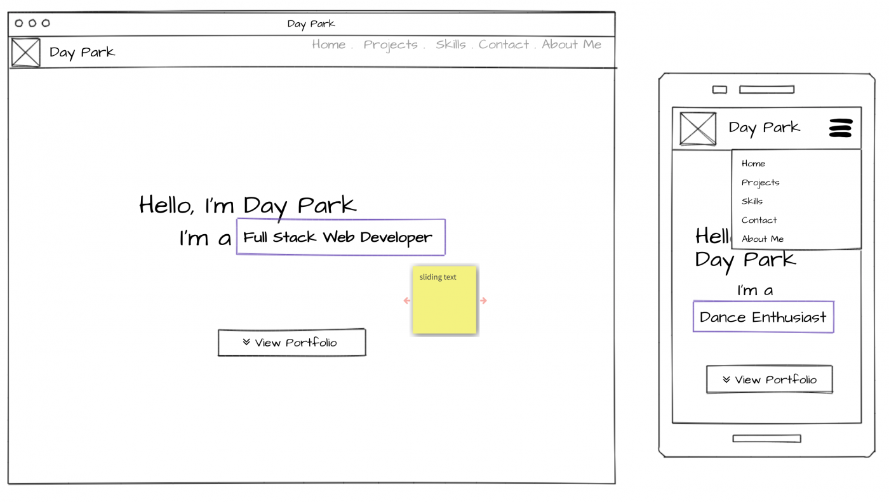
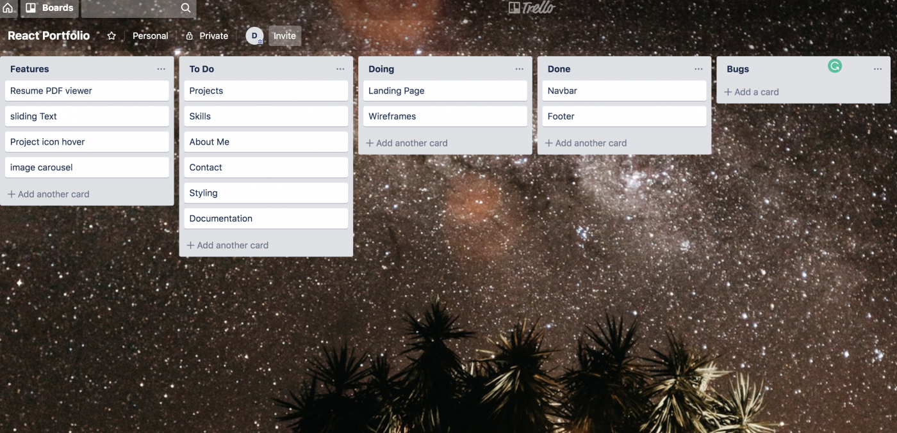

# Day Park Portfolio

Website: https://day1park.github.io/

# Table of Contents

- [Wireframes](#wireframe)
- [Design](#design)
- [Trello](#trello)
- [For the Future](#future)

## Wireframes 

### landing page

The landing / hero Page will contain the navbar and text welcoming to the webpage along with a sliding text feature which will loop through an array of titles. e.g. 'full stack web developer', 'dance enthusiast'

## Design 

Choice of colors chosen for a modern website feel.

1. #729799

2. #bfd1d3

3. #64778d

4. #e25b4b

5. #ecfdff

## Icons

- https://favicon.io/favicon-generator/

  <!-- - devicon  -->

## Packages

- react-strap

## Trello

## Future Features
