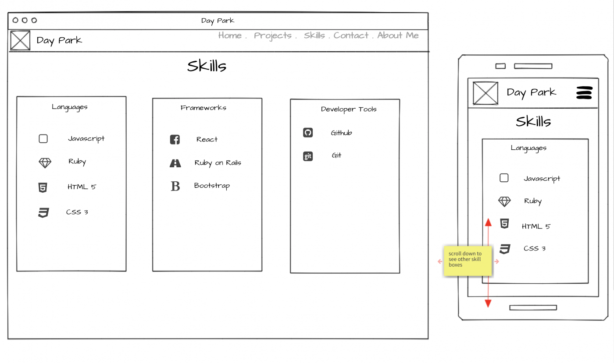

# Day Park Portfolio

Website: https://day1park.github.io/

# Table of Contents

- [Wireframes](#wireframe)
- [Design](#design)
- [Trello](#trello)
- [For the Future](#future)

## Wireframes 

### Landing page

The landing / hero Page will contain the navbar and text welcoming to the webpage along with a sliding text feature which will loop through an array of titles. e.g. 'full stack web developer', 'dance enthusiast'

### Skills component

skills component will consist of 3 skills containers which are seperated into 3 categories. Languages, Frameworks/Libraries and Developer Tools. They will contain icons with skill title next to icon. A feature to be implemented will be, just an icon and on hover a name will slide into view next to it pushing the icon to the left with title on the right.

In phone view when screen is minimized, the skills containers will be view in a single column.

## Design 

Choice of colors chosen for a modern website feel.

1. #729799

2. #bfd1d3

3. #64778d

4. #e25b4b

5. #ecfdff

## Icons

- https://favicon.io/favicon-generator/

  <!-- - devicon  -->

## Packages

- react-strap

## Trello

## Future Features
